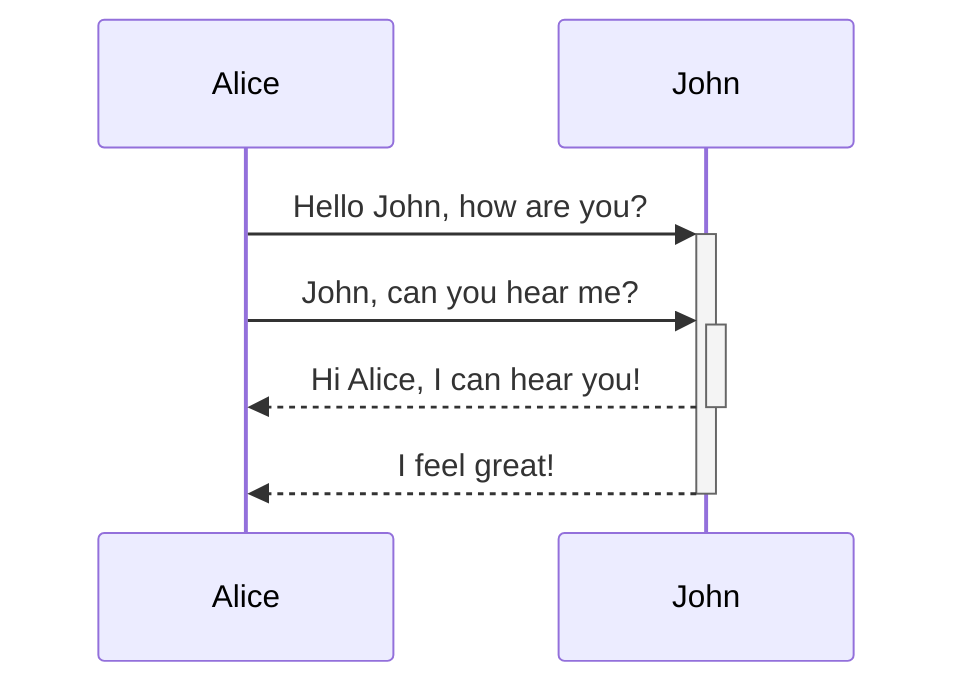

---
{
    "Author": "Ceyhan",
    "dg-home": true,
    "dg-publish": true,
    "dgPassFrontmatter": true,
    "dgEnableSearch": true,
    "dgLinkPreview": true,
    "dgShowBacklinks": true,
    "dgShowLocalGraph": true,
    "dgShowFileTree": true,
    "dgShowToc": true,
    "tags": [
        "gardenEntry"
    ],
    "title": "Hello World"
}
---

Hello World

# Callout
> [!Warning] Dikkat
> Dikkat Dikkat


# Dataview
```dataview
TABLE Author, Description
WHERE Author = "Ceyhan"
```

# Mermaid

## Json of Note Settings

```json
{
    "Author": "Ceyhan",
    "dg-home": true,
    "dgPassFrontmatter": true,
    "dg-publish": true,
    "dgSearch": true,
    "dg-search": true,
    "dgShowBacklinks": true,
    "dg-show-backlinks": true,
    "dg-show-file-tree": true,
    "dgShowLocalGraph": true,
    "dg-show-local-graph": true,
    "permalink": "home",
    "tags": [
        "gardenEntry"
    ],
    "title": "Hello World"
}
```
